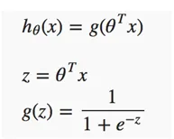
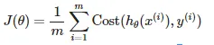
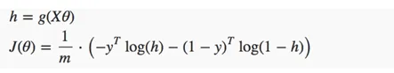
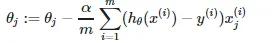
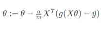

# Dslr
Introduction project of Datascience and Logistic Regression


# Choice of the parameters for the logistic regression

## Parameters
Best Hand, Arithmancy, Astronomy, Herbology, Defense Against the Dark Arts, Divination, Muggle
Studies,Ancient Runes, History of Magic, Transfiguration, Potions, Care of Magical Creatures,Charms, Flying

## Description deduction

``` python3 describe.py datasets/dataset_train.csv ```

Transfiguration values : mean 1030.097 std dev 44.111, min 906.627, max 1098.958
Charms values          : mean -243.374, std dev 8.781, min -261.049, max -225.428
Charms and transfiguation are not really dispersed and have close min / max values, it doesn't seem very relevant to use them. But I need further investigation.

## Histogram deduction

``` python3 histogram.py ```

<!-- Ancien runes, Defense Against the Dark Arts, History Of Magic have very different histograms by house, it seems a good choice for logistic regression.

Divination, Charms and Flying seems to have homogenous distributions -->

NOT SURE ABOUT IT

## Scatter Plot

``` python3 scatter_plot.py ```

Astronomy and Defense against Dark Magic are the 2 features similar / correlated.
We can only use one of them.

## Pair Plot

``` python3 pair_plot.py ```

Good : DefAgDrkMag, Herbology, Charms, Ancien Runes, Divination, Muggle Studies

Intermediate : History Of Magic, Flying => Take one of the 2, History Of Magic seems a bit better

Bad : Best Hand (too few values and bad distribution), Arithmancy (bad pair plot), Astronomy(correlated), Potions (bad pair plot), Care of MagCreat (bad pair plot), Transfiguration (bad std dev)

Final choice of parameters : DefAgDrkMag, Herbology, Charms, Ancien Runes, Divination, Muggle Studies and History Of Magic

# Logistic regression

## Use of logistic function




## Logistic regression cost function

Cost function global formula




Cost function for logistic regression



## Gradient descent

Global formula



Logistic regression formula

